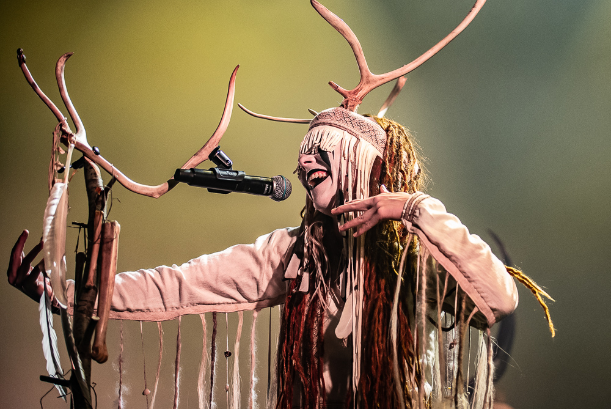

<!--
Készítette: Sándor Martin
Neptun kód: F145XS

Őszintén ezt megírva inkább érzem magam újságírónak, mintsem informatikusnak, de nagyon jól szórakoztam vele, és megfelel az összes kitűzött kötevetlménynek.
-->
# Heilung, avagy sámánzene a 21. században 
## Másfél évezreddel ezelőtt, de mégis itt
A történelem során számos zenélési mód emelkedett ki és vált eggyé a múlt homályával, de a 21. századi stílusok színkavalkádjában egy kicsi, de biztos helyet vájt ki magának a **Heilung**, akiknek tagjai [újraélesztik](https://www.season-of-mist.com/bands/heilung/) a pán-német és skandináv hagyatékuk zenéjét. Amikor az emberek hagyománymegőrzésről beszélnek, általában cifra mintás népi ruhákba öltözött táncosokra gondolnak, ami valóban minden nép hagyományainak részét képezik, azonban a Heilung nem elégedett meg azzal, hogy csak 100-200 évet mennek vissza az időben: egészen a gyökerekig visszatérve, a *Krisztus utáni 3. évszázad* germán törzseinek zenéjét próbálják újraalkotni az akkori római történészek leírásai alapján.  
 

 (Maria Franz, a Heilung énekese) 

## Generációs szakadék, vagy merítés a múltból?
>"Semmihez sem hasonlítható, de mégis ismerős"
  
Amikor megkérnek valakit, hogy írja le, milyen a Heilung zenéje, gyakran hasonló választ kapunk. Nem csoda, hiszen a kísérleti folk banda tagjai is csak ***amplified history***-ként tudnak hivatkozni a stílusukra, amit magyarul jobb híján csak felerősített történelemként tudunk lefordítani. Mindezek ellenére, az ismerős érzetnek is megvan az oka, ami egyben magyarázatot ad a banda Metal rajongók közötti népszerűségének is. A Heilung énekese, Maria Franz szerint van egy láthatatlan érzet ami összeköti a metálrajongókat, mivel a zenéjük a gyakori pörgősség ellenére gyakran meditatív hatású is egyben, így nem csoda, hogy a metalheadek sokszor meglepően nyugodtak és békések, hiszen a zenéjükben transzformációs jelleggel kiélhették frusztrációikat.  
Maria szerint ez köti össze a Heilungot a metállal és rockkal, ugyanis a régi népek zenéje a lélekre akar hatni, és ebből az érzetből táplálkozik tudat alatt a metál is.
>"Metal is a part of nature as well, it just had to be excavated. And in a way, Heilung is the earth from which it was dug up."

A hangszerek jelentős részét is saját maguk készítették:

+ Ló-, szarvas- és kecskebőrből készített dobok, némelyik emberi vérrel megfestve
+ Csontok, beleértve emberi alkarcsontot és szarvas csontokat
+ Egy bölényszarvból készített csörgő
+ Számos síp és ütőhangszer
+ ...és még sok minden más!

## Végszó
Ha olvasóimnak sikerült felkeltenem az érdeklődését eziránt a különleges banda iránt, akkor erősen ajánlom hogy [hallgassák meg](https://www.youtube.com/watch?v=SVbc_Fwbt50) a banda valamely dalát, vagy akár látogassanak el a koncertre, amit idén December 2-án tart a banda Budapesten!
